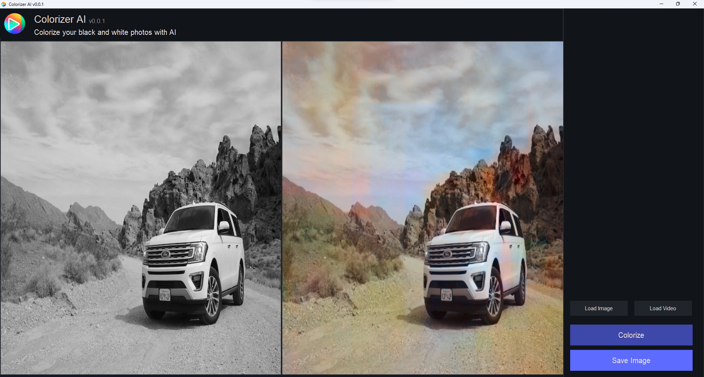

# Football Field Homography Estimation

This project is an application that captures live video from a moving camera for football field and converts the view into a top-down representation of a football field. This tool is designed for analyzing gameplay and tactics during football matches,

## Table of Contents
- [Introduction](#introduction)
- [Features](#features)
- [File Structure](#file-structure)
- [How It Works](#how-it-works)
- [Examples](#examples)
- [Getting Started](#getting-started)
  - [Installation](#installation)
  - [Usage](#usage)
  - [Custom Usage](#custom-usage)
- [Future Work](#future-work)
- [Contributing](#contributing)
- [License](#license)


## Introduction
In this project we have a desktop application that take a gray img and colorize it to rgb img with artificial intellegence.

## Features
- [x] Colorize gray img/frame
- [x] Work with static image
- [x] Work Live video

## Files Structure
```bash
    ├── gui_images
    │   ├── colored.jpg
    │   ├── gif_img.gif
    │   ├── gray.jpg
    │   ├── icon.ico
    │   └── icon.png
    │   
    ├── configpy
    ├── dataset.py
    ├── Disciminator.py
    ├── Generator.py
    ├── gui.py
    ├── loss.py
    ├── utils.py
    ├── train.ipynb
    ├── requirements.txt
    ├── README.md
    └── LICENSE
```

- `gui_images/`: contains the images used in gui.
- `config.py`: contains the configuration of the model.
- `dataset.py`: contains the dataset class.
- `Disciminator.py`: contains the discriminator class.
- `Generator.py`: contains the generator class.
- `gui.py`: contains the gui class.
- `loss.py`: contains the loss function.
- `utils.py`: contains the utils functions.
- `train.ipynb`: contains the training code.
- `requirements.txt`: contains all python dependencies needed for this project.

## How it works


1)  The main idea is converting imgs from rgb to lab color space in this color space
we can extract only one channel (L). This will be our input and we want to generate a new channel(A or B), so that when
we combine the input and the generated channel we will get the original rgb img.
in this task i use resnet18 as backbone and downsample with input shape (batch_size,1,width,height) then i use deconv2d layers as upsample layers,
to upsample img again to the shape shape with 2 channels (batch_size,2,width,height)


## Examples



## Getting Started
### Installation
1. Clone the repo
   ```sh
   git clone https://github.com/m7mdGNo/image_colorizer_with_GUI
    ```
2. Install requirements
    ```sh
    pip install -r requirements.txt
    ```
### Usage
- download weights from this link https://drive.google.com/file/d/1L6c0Xo-VYFac_ijtyBQ1aL809XKCdVW0/view?usp=sharing
- put the weights in the root folder
- open the gui application using py gui.py
- choose the input image/video
- save the img (this will be saved by default on /saved folder)


## Feuture Work
- [ ] Train the model on more data.
- [ ] Add more features to the gui.
- [ ] choose more complex model.


## Contributing
Pull requests are welcome. For major changes, please open an issue first to discuss what you would like to change.

## License
Distributed under the MIT License. See `LICENSE` for more information.
